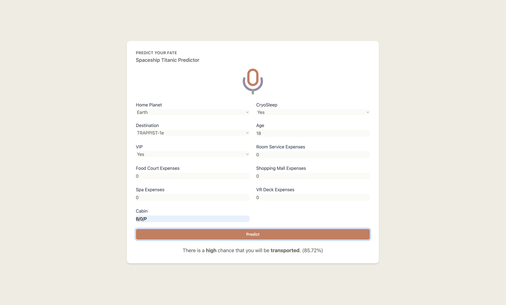

# Spaceship Titanic Predictor

## Project Overview
This project aims to predict passenger transportation outcomes on the Spaceship Titanic using machine learning techniques. It includes exploratory data analysis (EDA), statistical inference, machine learning model development, and deployment of a prediction service.

## Table of Contents
1. [Setup](#setup)
2. [Project Structure](#project-structure)
3. [Exploratory Data Analysis](#exploratory-data-analysis)
4. [Statistical Inference](#statistical-inference)
5. [Machine Learning Models](#machine-learning-models)
6. [Model Deployment](#model-deployment)
7. [UI Guide](#ui-guide)
8. [UI Screenshot](#ui-screenshot)
9. [Improvements and Future Work](#improvements-and-future-work)
10. [Contributors](#contributors)
11. [License](#license)

## Setup

### Prerequisites
- Python 3.12+
- Docker

### Installation
1. Clone the repository:
   ```
   git clone https://github.com/vytautas-bunevicius/kaggle-spaceship-titanic.git
   cd kaggle-spaceship-titanic
   ```

2. Create a virtual environment and install dependencies:
   ```
   python -m venv venv
   source venv/bin/activate  # On Windows use `venv\Scripts\activate`
   pip install -r requirements.txt
   ```

3. Build the Docker image:
   ```
   docker build -t spaceship-titanic-predictor .
   ```

4. Run the Docker container:
   ```
   docker run -p 8080:8080 spaceship-titanic-predictor
   ```

5. Access the application at `http://localhost:8080`

## Project Structure
- `notebooks/`: Jupyter notebook containing EDA, statistical analysis, and model development
- `src/`: Source code for the prediction service
- `data/`: Dataset files
- `models/`: Saved machine learning models
- `templates/`: HTML templates for the web interface
- `Dockerfile`: Instructions for building the Docker image
- `requirements.txt`: Python dependencies

## Exploratory Data Analysis
Our EDA process included:
- Statistical summaries of passenger data
- Visualization of key features and their relationships
- Anomaly detection in numerical features
- Correlation analysis between variables

Key findings and visualizations can be found in the `spaceship_titanic_analysis.ipynb` notebook.

## Statistical Inference
We conducted statistical inference to understand the relationships between various features and the likelihood of transportation. This included:
- Defining the target population (all passengers on the Spaceship Titanic)
- Formulating hypotheses about factors influencing transportation
- Constructing confidence intervals
- Conducting t-tests and chi-square tests

Detailed analysis and results are available in the `spaceship_titanic_analysis.ipynb` notebook.

## Machine Learning Models
We experimented with several machine learning models, including:
- Logistic Regression
- Random Forest
- XGBoost
- Stacked Ensemble (using H2O AutoML)

Hyperparameter tuning was performed using Optuna, and model ensembling was done using H2O's AutoML capabilities. The final model achieved a Kaggle score of > 0.79.

Model development and evaluation can be found in the `spaceship_titanic_analysis.ipynb` notebook.

## Model Deployment
The best-performing model (Stacked Ensemble) was deployed as a Flask web application, containerized using Docker for easy deployment and scalability.

## UI Guide
The web interface allows users to input passenger information and receive a prediction on whether the passenger will be transported.

1. Fill in the passenger details in the form:
   - Home Planet
   - CryoSleep status
   - Destination
   - Age
   - VIP status
   - Expenses (Room Service, Food Court, Shopping Mall, Spa, VR Deck)
   - Cabin

2. Click the "Predict" button.

3. The prediction result will be displayed, including:
   - Transportation outcome (Transported or Not Transported)
   - Probability of transportation
   - Interpretation of the probability (e.g., "There is a high chance that you will be transported.")

4. A visual probability bar indicates the likelihood of transportation.

5. The interface also displays a feature importance chart to help understand which factors most influence the prediction.

## UI Screenshot


*Caption: The Spaceship Titanic Predictor web interface, showing the input form and  prediction results*

## Improvements and Future Work
- Collect more data to improve model accuracy
- Experiment with deep learning models
- Implement real-time model updating
- Optimize the model for faster prediction times
- Implement user feedback mechanism to continually improve the model
- Explore additional feature engineering techniques
- Conduct more in-depth analysis of feature interactions
- Implement A/B testing for different model versions
